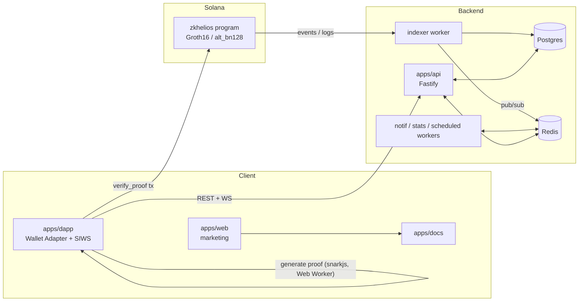

# Architecture

zkHelios is a Solana dApp for zero-knowledge proofs: prove a fact (balance,
ownership, membership, age) and verify it on-chain, revealing only public inputs.

## System diagram

## Flow: Commit → Prove → Verify

1. **Commit** — the dApp collects inputs (private inputs never leave the device).
2. **Prove** — `snarkjs` generates a Groth16 proof in a Web Worker.
3. **Verify** — the proof is submitted to the Anchor program, which runs the
   pairing check via `alt_bn128` syscalls (~100k CU) and writes a `ProofAccount` PDA.
4. **Index** — the indexer decodes the `ProofVerified` event → Postgres + Redis
   pub/sub → realtime WS + notifications.

## Packages

- `packages/ui`, `ui-tokens` — design system (chain-agnostic)
- `packages/idl` — generated Anchor IDL + TS types
- `packages/sdk-ts` — `@zkhelios/sdk` client
- `packages/db` — Prisma schema/client; `packages/shared-types` — API↔frontend types
- `packages/config-*` — shared TS/ESLint config

## Trust model

Verification is trustless and on-chain; anyone can re-verify a proof in-browser.
The indexer/API is a read convenience layer and never gates verification.
